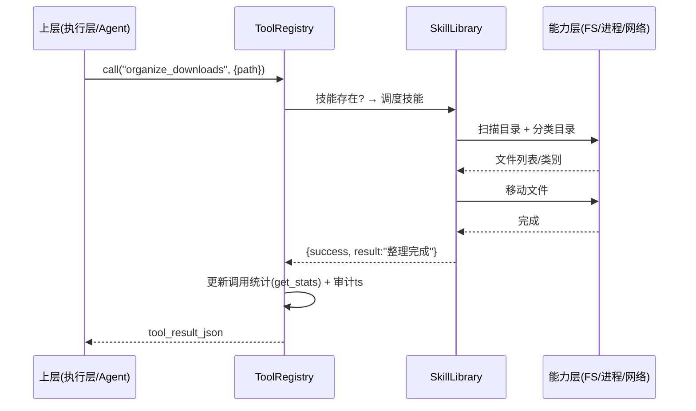
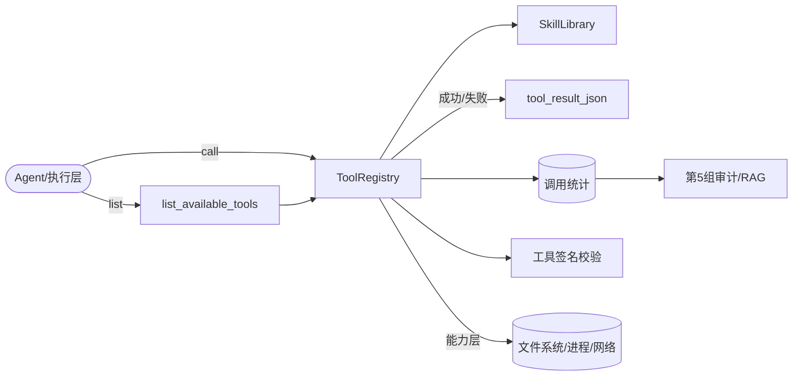

# 第 4 组设计文档

**模块：工具注册 + OS Skills（工具服务层）**
**对应 UFO²组件：Tools ｜ 所属层次：工具服务层 ｜ OS 原理关联：持久性（文件系统）**

- **课程**：操作系统设计 · Linux 桌面 Agentic OS
- **第 4 组**：工具服务层
- **版本**：v3.2（2026-09-11：危险指令硬拦截扩展为任意授权档位+coordinator 关闭均生效，**558 测试全绿**）

---

## 一、架构分析

### 1.1 第 4 组在系统架构中的位置

整个 Agentic OS 采用分层 + 审计的数据流（第 1→2→3→4 组，第 5 组协调）：

```
用户自然语言
   │
   ▼
[第1组] AI Shell + HostAgent ──► intent_json {intent,target,action,params}
   │
   ▼
[第5组] SystemCoordinator + SecuritySandbox ──► check_json {approved,risk_level}
   │
   ▼
[第2组] TaskPlanner + ControlDetector ──► plan_json {steps,elements}
   │
   ▼
[第3组] AppAgent + Automator ──► 执行：优先 GUI，可回退到工具
   │                                 │
   ▼                                 ▼
[第4组] ToolRegistry + SkillLibrary ◄── 工具调用 tool_result_json
   ├───────────────► MockToolRegistry（可整体替换，供跨组联调）
   └───────────────► 能力层（文件系统/进程/网络/浏览器/邮件/屏幕…）
   │
   ▼
[第5组] 审计日志 + RAG 执行轨迹存储
```

### 1.2 设计目标

| 目标 | 度量 |
|------|------|
| 统一性 | 上层只面对一份工具清单 + 一个调用入口 + 一种返回结构 |
| 可审计性 | 每次调用可统计（次数/结果），操作可回溯 |
| 安全性 | 危险/外发操作可被签名与风险分级约束 |
| 可联调性 | 提供与正式版同构的 Mock，其它组可离线开发 |
| 可移植性 | Windows / Linux 双平台同一套代码 |

### 1.3 关键设计取舍

- **用系统调用代替脆弱点坐标**：凡是 OS 能确定完成的（复制/移动/搜索/磁盘），一律工具化，不依赖 GUI 点击——这是第 4 组对"GUI 自动化可靠性"的根本态度；
- **Schema 由代码推断**：工具参数不透写两份（代码+Schema），而是由函数签名 + docstring 自动生成 JSON Schema，避免漂移；
- **结果统一归一**：`{success, result, error?}` 让上层无感知差异；
- **工具与技能分层**：工具=原子操作，技能=可编排的组合操作。

---

## 二、接口契约

### 2.1 输出接口（第 4 组 → 上层执行层）

按设计书第 4 组契约，统一为 **tool_result_json**：

```json
{
  "success": true,          // 或 false
  "result": "...",          // 成功时的结果（字符串/结构化对象）
  "error": "..."            // 仅 success=false 时出现
}
```

本组在契约基础上的**工程扩展**（保证可审计）：
```json
{
  "success": true,
  "result": "...",
  "tool": "organize_downloads",   // 调用的工具名
  "elapsed_ms": 42,               // 耗时
  "ts": "2026-09-09T09:00:00"     // 时间戳（供审计/RAG）
}
```

### 2.2 输入接口（上层 → 第 4 组）

| 接口 | 参数 | 返回 |
|------|------|------|
| `list_available_tools()` | — | 工具清单[{name, description, parameters(Schema)}] |
| `list_skills()` | — | 技能清单 |
| `call(name, params)` | 工具名 + 结构化参数 | tool_result_json |
| `call_skill(name, params)` | 技能名 + 结构化参数 | tool_result_json |
| `get_stats()` | — | 调用统计（总次数/各工具次数/最近结果） |
| `get_tool_signature(name)` | 工具名 | 该工具 SHA256 签名 |
| `register(name, func)` | 工具名 + 实现 | 注册成功并自动签名 |

### 2.3 与其它组的对接

| 对端组 | 对接物 | 说明 |
|--------|--------|------|
| 第 3 组（执行层） | `call(name, params)` → tool_result_json | 第 3 组在选择"GUI 或工具"时，确定性系统操作走第 4 组 |
| 第 2 组（任务规划） | 工具清单 / 技能清单 | 规划阶段即知有哪些能力可用 |
| 第 5 组（协调/安全/RAG） | 调用统计 / 审计时间戳 / 签名 | 审计与执行轨迹入库 |
| 全体（联调） | `MockToolRegistry`（59 工具同构） | 无真实系统时离线复现 |

---

## 三、模块设计

### 3.1 ToolRegistry（core/tool_registry.py，59 工具）

**职责**：统一注册、统一调用、Schema 生成、调用统计、工具签名。

```
核心结构：
- tools: dict[name -> func]          # 正式实现
- _tool_signatures: dict[name -> sha256]   # 注册时自动签名
- register(name, func, aliases)      # 可注册别名（move_file≡move_path）
- call(name, params)                 # 统一入口；try/except 归一错误
- list_available_tools()             # 导出含描述/Schema 的清单（供 LLM）
- get_stats()                        # 调用统计
- get_tool_signature / list_tool_signatures / 完整性校验
```

**功能域（59 工具归类）**：

| 域 | 代表工具 |
|----|----------|
| 文件 | copy/move/delete/rename、create_file、checksum、compare_files |
| 文件夹 | create/delete/list_directory、sort_directory、index_files、manage_archive |
| 文本 | read_text_file、write_text_file、edit_file |
| 批量/查找 | batch_copy/move、find_large/old/empty_files、search_files、search_in_files |
| 磁盘 | disk_usage、directory_size |
| 图片 | get_image_metadata、rotate_image |
| 系统 | current_directory、run_command（沙箱+超时） |
| 网络/浏览器 | browser_search、browser_extract、send_email、read_image |
| 应用/屏幕 | app_open、app_send_message、read_qq_chat、screen_inspect、activate_window |

### 3.2 SkillLibrary（core/skill_library.py，26 技能）

**职责**：把多个原子工具 + 业务逻辑编排成"一步到位"的组合技能，对应设计书"OS Skills 库"。

| 类别 | 技能 |
|------|------|
| 文件整理 | organize_downloads、smart_organize、cleanup_temp、cleanup_by_type、batch_archive、summarize_files、deduplicate_files |
| 查找/索引 | search_file、find_large/recent_files、rebuild_index、query_index、duplicate_finder |
| 回收/备份 | trash_file、restore_file、empty_trash、safe_delete、backup_file、restore_backup |
| 系统/应用 | system_info、app_open |
| 通信/联网 | app_send_message、read_qq_chat、send_email、browser_search、browser_extract |

**技能示例（organize_downloads）**——正是设计书演示场景 6「整理下载目录」：

```
输入：organize_downloads("~/Downloads")
逻辑：扫描目录所有文件 → 按扩展名映射类别(文档/图片/视频/音频/压缩包/…) →
      逐类创建子目录 → 移动文件 → 返回"整理完成"+ 分类统计
```

### 3.3 MockToolRegistry（mock/mock_tools.py，59 工具全量 Mock）

- 与正式版**同构**（同名、同参、同返回 todo_result_json），实现零负担切换；
- 内存实现（不改磁盘），保证跨组联调与测试的安全与可复现；
- 提供 `MockToolRegistry`, `MockSkillLibrary`, `MockOSServiceAPI` 三个类，对应各层接口。

### 3.4 安全与审计（与第 5 组协同）

- 危险/外发操作（删除、清空回收站、QQ 发消息、发邮件）由上层安全确认；第 4 组在工具实现侧仍保留**白名单与风险标注**；
- 每次 `call` 记录时间戳/耗时/结果到统计与审计，供第 5 组 RAG 与审计日志使用。

---

## 四、流程图

### 4.1 一次工具调用时序（call）



### 4.2 数据流与审计



---

## 五、可行性分析

| 维度 | 分析 | 结论 |
|------|------|------|
| 技术可行 | 核心基于 Python 标准库 `shutil`/`subprocess`/`pathlib`/`psutil`，全跨平台、零外部重依赖 | 高 |
| 接口可行 | 统一 `tool_result_json` 已与设计书契约、MCP `CallToolResult` 对齐 | 高 |
| 联调可行 | 提供 59 工具同构 Mock，其它组无需真实系统即可联调 | 高 |
| 测试可行 | 558 项测试全绿，含统计/签名/异常/恢复/协调层/危险指令硬拦截等 | 高 |
| 跨平台可行 | Windows 实测通过；路径/编码/临时目录均已做双平台适配（Ubuntu 为验收目标） | 高 |

---

## 六、风险评估与对策

| 风险 | 影响 | 对策 |
|------|------|------|
| 危险操作误执行（删除/格式化） | 用户数据丢失 | 删除类/外发类工具标注高风险，配合第 5 组安全确认；测试只在临时/安全目录跑 |
| 工具参数由 LLM 生成可能不合法 | 运行时异常 | `call()` 统一 try/except 归一为 `{success:false,error}`；Schema 校验参数 |
| 跨平台行为差异（Win/Linux 路径） | Linux 验收失败 | 全 `pathlib` + 双平台适配（`app_controller` 分实现、CDP 跨平台）；已做 Linux 可移植性专项 |
| 工具输出超长占用 token | 请求慢/贵 | 超长结果自动截断（默认前 4000 字符）+ 可针对性再读（09-08 落地） |
| 个人 key 泄漏随代码分发 | 资损/安全 | `config.yaml` 个人敏感字段靠 `.gitignore`+skip-worktree 不入库，分发的是空模板 `config.yaml.example`（09-09 落地） |
| 其它组接口变更 | 集成失败 | 严守接口契约 + ADR 记录决策（docs/adr/*）追踪演进 |

---

*配套文档：`docs/第4组调研报告.md`、`docs/第4组接口文档.md`、`docs/第4组单元测试报告.md`、`docs/第4组联调与集成报告.md`、`docs/第4组交付说明.md`、`docs/adr/*`。*